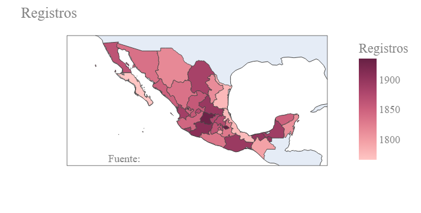
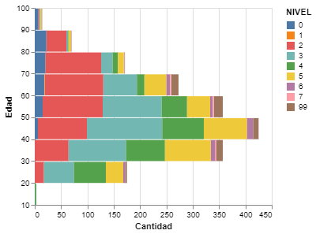
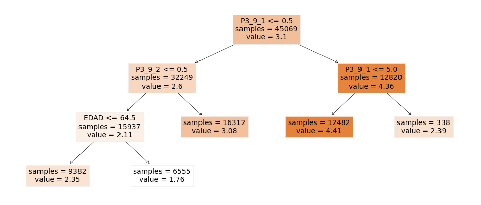
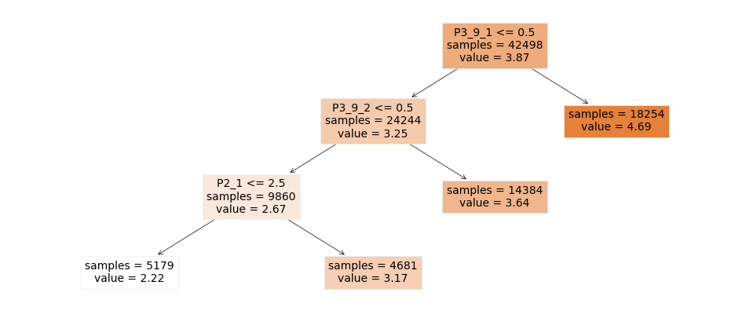

# Uso de la tecnologia en México

Por: Manuel Gastelum, Ricardo Gutiérrez y Gabriel Varela

Este proyecto que se muestra a continuación contiene una muestra de datos sobre el uso de la tecnología en México; el uso de las diferentes tic's como el uso del internet y sus diferentes variables provenientes de la encuesta del INEGI. Se limpiaron los datos para buscar una relación de los servicios y comodidades en función del nivel académico.

# Introducción 

El alcance de la tecnología dentro de la globalización en la última década se ha puesto al alcance de toda la población. La "Encuesta Nacional sobre Disponibilidad y Uso de Tecnologías de la Información en los Hogares (ENDUTIH) 2021" es el nombre de la encuesta realizada por el INEGI con una muestra de aproximadamente de 60,000 viviendas encuestadas, en total son 200,000 personas en las 32 entidades del país a las que se les realiza este cuestionario aproximadamente. Fuente: [INEGI](https://www.inegi.org.mx/programas/dutih/2021/) muestra algunas características de internet, telefonía y computación para el entretenimiento, educación, redes sociales y comunicación, capacitación, trabajo/empresa y ventas por internet (e commerce).

El software utilizado en este trabajo es python 3 con apoyo de la herramienta de jupyter notebook asimismo, comienza con un análisis exploratorio (EDA) que nos arroja algunas características importantes, relevantes para el uso de algún algoritmo. Se utilizan diferentes herramientas de python como Altair, geojson y skitlearn para descifrar y entender la información que ofrecen los datos. Las herramientas en manos de científicos de datos intentan clasificar los servicios y comodidades en función de su grado académdico. 

Es importante mencionar al lector que existen algunas impresiciones en el uso de los datos durante la limpieza para facilitar el análisis, debido a que el diccionario puesto por el INEGI puede resultar ambiguo, esto puede afectar en el resultado final como se verá en la siguientes secciones de este trabajo.

# Los Datos

Los datos de esta encuesta se componen de 3 tablas: vivienda, hogar y residentes. Cada tabla ofrece datos según el tópico que describe, en el caso de la vivienda y el hogar muestra las siguientes variables:

<ol>
    <li>UPM - Unidad primaria de muestreo</li>
    <li>VIV_SEL - Vivienda Seleccionada</li>
    <li>P1_1 - Material piso vivienda - 1 Tierra, 2 Cemento o firme, 3 Madera, mosaico u otro recubrimiento</li>
    <li>P1_2 - Método de surtido de agua - 1 agua entubada dentro de la vivienda?, 2 agua entubada fuera de la vivienda, pero dentro del terreno?, 3 agua entubada de llave pública (o hidrante)?, 4  agua entubada que acarrean de otra vivienda?, 5 agua de pipa?, 6 agua de un pozo, río, arroyo, lago u otro?</li>
    <li>P1_3 - Drenaje - 1 la red pública?, 2 una fosa séptica?, 3 una tubería que va a dar a una barranca o grieta?, 4 una tubería que va a dar a un río, lago o mar?, 5 ¿No tiene drenaje? </li>
    <li>P1_4 - Energía Eléctrica - 1 Sí, 2 No</li>
    <li>P1_5_1 - Disponen de refrigerador - 1 Sí, 2 No</li>
    <li>P1_5_2 - Disponen de lavadora - 1 Sí, 2 No</li>
    <li>P1_5_3 - Disponen de automovil - 1 Sí, 2 No</li>
    <li>P2_1 - Cuantas personas viven en la casa</li>
    <li>P2_2 - Todas las personas comparten el mismo gasto? - 1 Sí, 2 No</li>
    <li>P2_3 - Cuántos hogares o grupos tienen gasto separado</li>
    <li>P4_1_1 - Disponen de radio - 1 Sí, 2 No</li>
    <li>P4_1_2 - Disponen de Televisor analógico - 1 Sí, 2 No</li>
    <li>P4_1_3 - Disponen de decodificador de TV digital abierta - 1 Sí, 2 No</li>
    <li>P4_1_4 - Disponen de pantalla plana - 1 Sí, 2 No</li>
    <li>P4_1_5 - Disponen de Consola de videojuegos - 1 Sí, 2 No</li>
    <li>P4_1_6 - Disponen de celular - 1 Sí, 2 No</li>
    <li>P4_1_6_1 - Cuantos celulares tienen - 99 No Sabe</li>
    <li>P4_1_6_2 - Cuantos celulares son inteligentes - 99 No sabe</li>
    <li>P4_2_1 - Disponen de computadora de escritorio - 1 Sí, 2 No</li>
    <li>P4_2_2 - Disponen de laptop - 1 Sí, 2 No</li>
    <li>P4_2_3 - Disponen de tablet - 1 Sí, 2 No</li>
    <li>P4_3 - motivo por el que no tienen computadora, laptop o tablet - 1 Falta de recursos económicos, 2 No les interesa o no la necesitan, 3 No saben usarla, 4 Utilizan un celular inteligente (Smartphone) u otro dispositivo para conectarse a Internet, 5 Porqué está descompuesta, 6 Por razones relacionadas con la privacidad o seguridad, 7 Otra razón, 8 No responde</li>
    <li>P4_3A - Otra razón</li>
    <li>P4_4 - Disponen de internet - 1 Sí, 2 No</li>
    <li>P4_8 - Porque no disponen de internet - 1 Falta de recursos económicos (servicio incosteable), 2 No les interesa o no lo necesitan, 3 No sabe usarlo, 4 Desconoce su utilidad, 5 Equipo insuficiente o sin capacidad, 6 No hay proveedor o infraestructura en su localidad, 7 Tienen acceso a Internet en otros lugares, 8 Por razones relacionadas con la privacidad o seguridad, 9 Otra razón, 10 No responde</li>
    <li>P5_8_2 - Monto pagado a servicios digitales - 0 no paga, 9999 No sabe</li>
    <li>P5_11_1 - Esta satisfecho con el servicio de internet - 1 Satisfecho, 2 Insatisfecho, 3 No cuenta con el servicio, 8 No quiso o no supo responder </li>
</ol>

Las variables buscan caracterizar la situación de los residentes con preguntas de servicios básicos, condiciones básicas del hogar y comodidades a su vez, esto interpreta el estratro social al que pertenece.

En la siguiente tabla residentes contienen preguntas del tipo académico, tanto el grado, uso de teléfonos inteligentes, uso de internet, entre otras características que se muestran a continuación:

<ol>
    <li>PAREN - Parentesco con el jefe del hogar - 1 Jefe(a), 2 Esposo(a) o compañero(a), 3 Hijo(a), 4 Nieto(a), 5 Otro parentesco, 6 Sin parentesco</li>
    <li>SEXO - Genero (hombre o mujer)</li>
    <li>EDAD</li>
    <li>P3_7 - Asiste Actualmente a la escuela</li>
    <li>NIVEL - Nivel máximo de estudios - 00 Ninguno, 01 Preescolar o kínder, 02 Primaria, 03 Secundaria, 04 Normal básica, 05 Estudio técnico terminal con secundaria, 06 Preparatoria o bachillerato, 08 Licenciatura o ingeniería, 09 Especialidad,  10 Maestría, 11 Doctorado, 99 No sabe </li>
    <li>GRADO - Año o grado máximo</li>
    <li>P3_9_1 - Uso de computadora  en los últimos 3 meses - 1 Sí, 2 No, 9 No sabe</li>
    <li>P3_9_2 - Uso de internet en los últimos 3 meses - 1 Sí, 2 No, 9 No sabe</li>
    <li>P3_9_3 - Uso de celular en los últimos 3 meses - 1 Sí, 2 No, 9 No sabe</li>
    <li>UPM_DIS - Unidad primaria de muestreo</li>
    <li>EST_DIS - Estrato de diseño muestral</li>
    <li>DOMINIO - Población rural y urbana - U urbana R rural</li>
    <li>TLOC - Tamaño de la localidad - 1 100,000 y más habitantes, 2 15,000 a 99,999 habitantes, 3 2,500 a 14,999 habitantes, 4 menor a 2500 habitantes</li>
    <li>ENT - Entidad - 01 Aguascalientes, 02 Baja California, 03 Baja California Sur, 04 Campeche, 05 Coahuila de Zaragoza, 06 Colimia, 07 Chiapas, 08 Chihuahua, 09 Ciudad de México, 10 Durango, 11 Guanajuato, 12 Guerrero, 13 Hidalgo, 14 Jalisco, 15 Estado de México, 16 Michoacán de Ocampo, 17 Morelos, 18 Nayarit, 19 Nuevo León, 20 Oaxaca, 21 Puebla, 22 Querétaro, 23 Quintana Roo, 24 San Luis Potosí, 25 Sinaloa, 26 Sonora, 27 Tabasco, 28 Tamaulipas, 29 Tlaxcala, 30 Veracruz de Ingancio de la Llave, 31 Yucatán, 32 Zacatecas
</li>
</ol>

# Resultados

Los resultados de esta exploración y entrenamiento se pueden ver leer con mayor detalle en la siguiente [sección](doc/Resultados.md):

## Análisis Exploratorio de Datos (EDA)

En este apartado se muestra la exploración de los datos después de la limpieza y organización en función del problema. Comenzamos por saber el muestreo que realizó INEGI, en promedio por estado son 1800 registros tomando como base el jefe de familia (provedor) como se puede observar en la siguiente imagen:

|  |
|:--:|
| <b>Mapa de cantidad de personas en el registro por entidad federativa</b>|

De lo anterior nos damos cuenta de la proporción de hombres y mujeres como jefa de familia, el nivel educativo en función de la edad, el uso de la tecnología, etc., se generan preguntas que se abordarán en las discusiones más adelante como ¿Mantiene a la familia o es madre soltera?, ¿las generaciones de 60 años o más se les dificulta el uso de la tecnología?, invariablemente todos usan el internet de manera primaria, secundaria o terciaria ¿El uso del internet se ha vuelto una necesidad en todos los estratos sociales?, entre otras más situaciones.

Al mismo tiempo se explora al jefe de familia por sexo, edad, nivel educativo, uso de la computadora y el uso del internet en un tiempo no mayor a 3 meses. Posterior a esto, se aplica un filtro para el estado de Jalisco para entender si el comportamiento es similar a lo que se observa con la muestra completa de los datos. El estado de Jalisco tiene un comportamiento promedio respecto a la muestra, la edad en función del nivel académico nos arroja que a mayor edad el nivel educativo se queda en primaria y secundaria, si la edad es de 20 años hasta los 50 años existe una mayor población con preparatoria y licenciatura con una minoría en educación especializada. En el rango 10 a 20 años no existe como tal un nivel educativo debido que son los años de conclusión de los estudios de primaria, secundaria, bachillerato y licenciatura como se muestra en la siguiente imágen:

|  |
|:--:|
| <b>Número de registros de jefes de vivivenda por nivel educativo y edad en el estado de Jalisco</b>|

## Modelo de clasificación por árboles de decisión

Se realiza el entrenamiento en dos conjuntos distintos, uno corresponte al nivel eductativo del jefe de la vivienda y el otro al máximo nivel eductativo logrado por alguno de los habitantes de la vivienda.

En esta primer entrenamiento puede observarse que el Uso de la computadora en los últimos 3 meses (P_3_9_1) es el nodo principal de la clasifiación, seguido del uso del internet en los últimos 3 meses. 

|  |
|:--:|
| <b>Arbol de decisión para clasificar el nivel educativo (restructurado) para el jefe de vivienda en México</b>|

En esta clasificación se obtienen resultados parecidos (1ro y 2do nodo).

|  |
|:--:|
| <b>Arbol de decisión para clasificar el nivel educativo (restructurado) para la persona con máximo nivel de estudios en la vivienda</b>|

Con estos árboles podemos hablar que el uso de la computadora y el internet si ayuda a predecir el nivel educativo de las personas en la vivienda (jefe y máximo nivel de estudios). 

# Difusión

Este proyecto fue compartido publicamente en LinkedIn y la publicación puede ser encontrada en el siguiente [enlace](https://www.linkedin.com/)

# Referencias

- Amat Rodrigo, J. (s. f.). Arboles de decision python. Cienciadedatos.net. https://www.cienciadedatos.net/documentos/py07_arboles_decision_python.html

- scikit-learn: machine learning in Python — scikit-learn 0.16.1 documentation. (s. f.-b). https://scikit-learn.org/

- pandas - Python Data Analysis Library. (s. f.). https://pandas.pydata.org/

- INEGI. Encuesta Nacional sobre Disponibilidad y Uso de Tecnologías de la Información en los Hogares (ENDUTIH) 2021. https://www.inegi.org.mx/programas/dutih/2021/
