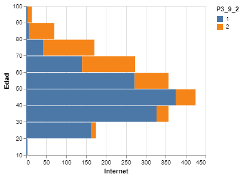

# Resultados

## Análisis EDA

Se utilizan los siguientes datos que corresponden a los residentes encuestados. Para nuestro estudio unos de los datos más importantes es 'NIVEL' y corresponde al nivel educativo de la persona encuestada.

|    UPM |   VIV_SEL |   HOGAR |   NUM_REN |   PAREN |   SEXO |   EDAD |   DIA |   MES |   P3_7 |   NIVEL |   GRADO |   P3_9_1 |   P3_9_2 |   P3_9_3 |   P3_10 |   P3_11 |   P3_12 |   FAC_HOGAR |   UPM_DIS |   EST_DIS | DOMINIO   |   TLOC |   ESTRATO |   ENT |
|-------:|----------:|--------:|----------:|--------:|-------:|-------:|------:|------:|-------:|--------:|--------:|---------:|---------:|---------:|--------:|--------:|--------:|------------:|----------:|----------:|:----------|-------:|----------:|------:|
| 100023 |         1 |       1 |         1 |       1 |      2 |     41 |    16 |     9 |      2 |      10 |       2 |        1 |        1 |        1 |       1 |     nan |       1 |         174 |         1 |         7 | U         |      1 |         3 |     1 |
| 100023 |         2 |       1 |         1 |       1 |      1 |     46 |     2 |     9 |      2 |       6 |       3 |        2 |        1 |        1 |       7 |     nan |     nan |         174 |         1 |         7 | U         |      1 |         3 |     1 |
| 100023 |         2 |       1 |         2 |       2 |      2 |     47 |     5 |     9 |      2 |       3 |       3 |        2 |        1 |        1 |       6 |       4 |     nan |         174 |         1 |         7 | U         |      1 |         3 |     1 |
| 100023 |         2 |       1 |         3 |       3 |      2 |     23 |    22 |     1 |      2 |       6 |       3 |        1 |        1 |        1 |       1 |     nan |       1 |         174 |         1 |         7 | U         |      1 |         3 |     1 |
| 100023 |         2 |       1 |         5 |       3 |      2 |     17 |    22 |    10 |      1 |       6 |       2 |        1 |        1 |        1 |       5 |       4 |     nan |         174 |         1 |         7 | U         |      1 |         3 |     1 |
| 100023 |         2 |       1 |         6 |       3 |      1 |     13 |    25 |     8 |      1 |       3 |       1 |        1 |        1 |        1 |       5 |       4 |     nan |         174 |         1 |         7 | U         |      1 |         3 |     1 |
| 100023 |         2 |       1 |         4 |       3 |      2 |     21 |    17 |     9 |      2 |       6 |       3 |        1 |        1 |        1 |       6 |       4 |     nan |         174 |         1 |         7 | U         |      1 |         3 |     1 |
| 100023 |         3 |       1 |         1 |       1 |      2 |     50 |     5 |     6 |      2 |       8 |       4 |        1 |        1 |        1 |       1 |     nan |       1 |         174 |         1 |         7 | U         |      1 |         3 |     1 |
| 100023 |         3 |       1 |         2 |       3 |      2 |     19 |     5 |     6 |      1 |       8 |       1 |        1 |        1 |        1 |       1 |     nan |       1 |         174 |         1 |         7 | U         |      1 |         3 |     1 |
| 100023 |         4 |       1 |         1 |       1 |      1 |     56 |    16 |     8 |      2 |       2 |       6 |        2 |        1 |        1 |       1 |     nan |       4 |         174 |         1 |         7 | U         |      1 |         3 |     1 |

A continuación se presentan los datos de la vivienda. Aquí se presentan distintos atributos que nos ayudarán a saber la cantidad de tecnología presente en la vivienda.

|    UPM |   VIV_SEL |   P1_1 |   P1_2 |   P1_3 |   P1_4 |   P1_5_1 |   P1_5_2 |   P1_5_3 |   P2_1 |   P2_2 |   P2_3 |   FAC_VIV |   UPM_DIS |   EST_DIS | DOMINIO   |   TLOC |   ESTRATO |   ENT |
|-------:|----------:|-------:|-------:|-------:|-------:|---------:|---------:|---------:|-------:|-------:|-------:|----------:|----------:|----------:|:----------|-------:|----------:|------:|
| 100023 |         1 |      3 |      1 |      1 |      1 |        1 |        1 |        1 |      1 |      1 |    nan |       174 |         1 |         7 | U         |      1 |         3 |     1 |
| 100023 |         2 |      3 |      1 |      1 |      1 |        1 |        1 |        1 |      6 |      1 |    nan |       174 |         1 |         7 | U         |      1 |         3 |     1 |
| 100023 |         3 |      3 |      1 |      1 |      1 |        1 |        1 |        1 |      2 |      1 |    nan |       174 |         1 |         7 | U         |      1 |         3 |     1 |
| 100023 |         4 |      3 |      1 |      1 |      1 |        1 |        1 |        2 |      9 |      1 |    nan |       174 |         1 |         7 | U         |      1 |         3 |     1 |
| 100023 |         5 |      3 |      1 |      1 |      1 |        1 |        1 |        2 |      3 |      1 |    nan |       174 |         1 |         7 | U         |      1 |         3 |     1 |
| 100029 |         1 |      3 |      1 |      1 |      1 |        1 |        1 |        2 |      5 |      1 |    nan |       222 |         2 |         6 | U         |      1 |         2 |     1 |
| 100029 |         2 |      3 |      1 |      1 |      1 |        1 |        1 |        1 |      3 |      1 |    nan |       222 |         2 |         6 | U         |      1 |         2 |     1 |
| 100029 |         3 |      2 |      1 |      1 |      1 |        2 |        2 |        2 |      5 |      1 |    nan |       222 |         2 |         6 | U         |      1 |         2 |     1 |
| 100029 |         5 |      3 |      1 |      1 |      1 |        1 |        1 |        1 |      3 |      1 |    nan |       222 |         2 |         6 | U         |      1 |         2 |     1 |
| 100037 |         1 |      3 |      1 |      1 |      1 |        1 |        1 |        2 |      6 |      1 |    nan |       169 |         3 |         7 | U         |      1 |         3 |     1 |

## 