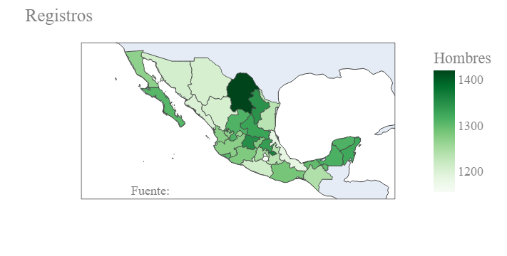

# Resultados

## Análisis EDA

Se utilizan los siguientes datos que corresponden a los residentes encuestados. Para nuestro estudio unos de los datos más importantes es 'NIVEL' y corresponde al nivel educativo de la persona encuestada.

|    UPM |   VIV_SEL |   HOGAR |   NUM_REN |   PAREN |   SEXO |   EDAD |   DIA |   MES |   P3_7 |   NIVEL |   GRADO |   P3_9_1 |   P3_9_2 |   P3_9_3 |   P3_10 |   P3_11 |   P3_12 |   FAC_HOGAR |   UPM_DIS |   EST_DIS | DOMINIO   |   TLOC |   ESTRATO |   ENT |
|-------:|----------:|--------:|----------:|--------:|-------:|-------:|------:|------:|-------:|--------:|--------:|---------:|---------:|---------:|--------:|--------:|--------:|------------:|----------:|----------:|:----------|-------:|----------:|------:|
| 100023 |         1 |       1 |         1 |       1 |      2 |     41 |    16 |     9 |      2 |      10 |       2 |        1 |        1 |        1 |       1 |     nan |       1 |         174 |         1 |         7 | U         |      1 |         3 |     1 |
| 100023 |         2 |       1 |         1 |       1 |      1 |     46 |     2 |     9 |      2 |       6 |       3 |        2 |        1 |        1 |       7 |     nan |     nan |         174 |         1 |         7 | U         |      1 |         3 |     1 |
| 100023 |         2 |       1 |         2 |       2 |      2 |     47 |     5 |     9 |      2 |       3 |       3 |        2 |        1 |        1 |       6 |       4 |     nan |         174 |         1 |         7 | U         |      1 |         3 |     1 |
| 100023 |         2 |       1 |         3 |       3 |      2 |     23 |    22 |     1 |      2 |       6 |       3 |        1 |        1 |        1 |       1 |     nan |       1 |         174 |         1 |         7 | U         |      1 |         3 |     1 |
| 100023 |         2 |       1 |         5 |       3 |      2 |     17 |    22 |    10 |      1 |       6 |       2 |        1 |        1 |        1 |       5 |       4 |     nan |         174 |         1 |         7 | U         |      1 |         3 |     1 |
| 100023 |         2 |       1 |         6 |       3 |      1 |     13 |    25 |     8 |      1 |       3 |       1 |        1 |        1 |        1 |       5 |       4 |     nan |         174 |         1 |         7 | U         |      1 |         3 |     1 |
| 100023 |         2 |       1 |         4 |       3 |      2 |     21 |    17 |     9 |      2 |       6 |       3 |        1 |        1 |        1 |       6 |       4 |     nan |         174 |         1 |         7 | U         |      1 |         3 |     1 |
| 100023 |         3 |       1 |         1 |       1 |      2 |     50 |     5 |     6 |      2 |       8 |       4 |        1 |        1 |        1 |       1 |     nan |       1 |         174 |         1 |         7 | U         |      1 |         3 |     1 |
| 100023 |         3 |       1 |         2 |       3 |      2 |     19 |     5 |     6 |      1 |       8 |       1 |        1 |        1 |        1 |       1 |     nan |       1 |         174 |         1 |         7 | U         |      1 |         3 |     1 |
| 100023 |         4 |       1 |         1 |       1 |      1 |     56 |    16 |     8 |      2 |       2 |       6 |        2 |        1 |        1 |       1 |     nan |       4 |         174 |         1 |         7 | U         |      1 |         3 |     1 |

A continuación se presentan los datos de la vivienda. Aquí se presentan distintos atributos que nos ayudarán a saber la cantidad de tecnología presente en la vivienda.

|    UPM |   VIV_SEL |   P1_1 |   P1_2 |   P1_3 |   P1_4 |   P1_5_1 |   P1_5_2 |   P1_5_3 |   P2_1 |   P2_2 |   P2_3 |   FAC_VIV |   UPM_DIS |   EST_DIS | DOMINIO   |   TLOC |   ESTRATO |   ENT |
|-------:|----------:|-------:|-------:|-------:|-------:|---------:|---------:|---------:|-------:|-------:|-------:|----------:|----------:|----------:|:----------|-------:|----------:|------:|
| 100023 |         1 |      3 |      1 |      1 |      1 |        1 |        1 |        1 |      1 |      1 |    nan |       174 |         1 |         7 | U         |      1 |         3 |     1 |
| 100023 |         2 |      3 |      1 |      1 |      1 |        1 |        1 |        1 |      6 |      1 |    nan |       174 |         1 |         7 | U         |      1 |         3 |     1 |
| 100023 |         3 |      3 |      1 |      1 |      1 |        1 |        1 |        1 |      2 |      1 |    nan |       174 |         1 |         7 | U         |      1 |         3 |     1 |
| 100023 |         4 |      3 |      1 |      1 |      1 |        1 |        1 |        2 |      9 |      1 |    nan |       174 |         1 |         7 | U         |      1 |         3 |     1 |
| 100023 |         5 |      3 |      1 |      1 |      1 |        1 |        1 |        2 |      3 |      1 |    nan |       174 |         1 |         7 | U         |      1 |         3 |     1 |
| 100029 |         1 |      3 |      1 |      1 |      1 |        1 |        1 |        2 |      5 |      1 |    nan |       222 |         2 |         6 | U         |      1 |         2 |     1 |
| 100029 |         2 |      3 |      1 |      1 |      1 |        1 |        1 |        1 |      3 |      1 |    nan |       222 |         2 |         6 | U         |      1 |         2 |     1 |
| 100029 |         3 |      2 |      1 |      1 |      1 |        2 |        2 |        2 |      5 |      1 |    nan |       222 |         2 |         6 | U         |      1 |         2 |     1 |
| 100029 |         5 |      3 |      1 |      1 |      1 |        1 |        1 |        1 |      3 |      1 |    nan |       222 |         2 |         6 | U         |      1 |         2 |     1 |
| 100037 |         1 |      3 |      1 |      1 |      1 |        1 |        1 |        2 |      6 |      1 |    nan |       169 |         3 |         7 | U         |      1 |         3 |     1 |

La cantidad de registros en estas tablas se encuentra organizada por entidad federativa de la República Mexicana y se puede apreciar en el siguiente mapa.

|  |
|:--:|
| <b>Mapa de cantidad de personas en el registro por entidad federativa</b>|

De igual manera se pueden representar cuales de estos registros son hombres y mujeres en el mapa. Pueden observarse algunas diferencias en los mapas como entre el noroeste y noreste del pais que parecen invertirse. Lo anterior puede representar un posible sesgo en la recolección de los datos.

|  |
|:--:|
| <b>Mapa de cantidad de Mujeres en el registro por entidad federativa</b>|

|  |
|:--:|
| <b>Mapa de cantidad de Hombres en el registro por entidad federativa</b>|

Para nuestro estudio utilizamos el Jefe de cada vivienda para seguir con el análisis. A continuación se diferencia sexo del jefe de la vivienda por nivel académico. Puede observarse claramente como en este caso si existe un dominio del sexo masculino en nivel educativo.

|  |
|:--:|
| <b>Cantidad de registros de cada jefe de vivienda según nivel educativo y sexo</b>|

Ahora comparamos el nivel educativo según la edad de cada registro. En el siguiente gráfico puede observarse como el nivel educativova disminuyendo según subimos en la edad de cada encuestado.

|  |
|:--:|
| <b>Cantidad de registros según edad y nivel educativo de los jefes de vivienda</b>|

### Jalisco

En esta sección se repiten algunos de los análsis, pero nos enfocamos en los registros del estado de Jalisco. Se puede observar como el efecto es ligeramente más pronunciado que en el caso de los datos nacionales, conforme se incrementa el nivel educativo son menos mujeres las que son jefes de vvivienda.

|  |
|:--:|
| <b>Número de registros de jefes de vivivenda por nivel educativo y sexo en el estado de Jalisco</b>|

En la siguiente parte se revisa nuevamente el nivel educativo por edad. Puede observarse como el patrón nacional se repite, conforme sube la edad, el nivel educativo va disminuyendo.

|  |
|:--:|
| <b>Número de registros de jefes de vivivenda por nivel educativo y edad en el estado de Jalisco</b>|

Ahora revisamos el uso de la computadora o pc por edad. Puede observars como también este valor va disminuyendo con la edad, siendo el máximo entre los 30 y 50 años. Lo anterior tiene sentido ya que se trata en las edades donde existen más trabajadores. Es importante mencionar que el uso de la pc en los últimos 3 meses nunca es dominante en estos niveles de edad gráficados.

|  |
|:--:|
| <b>Número de registros de jefes de vivivenda por uso de la computadora en los últimos 3 meses y edad en el estado de Jalisco</b>|

Por último se revisa el uso del internet en los últimos 3 meses. Puede observarse como a diferencia del gráfico anterior este si es dominante en la población por edad en general. Nuevamente se observa como disminuye conforme incrementa la edad.

|  |
|:--:|
| <b>Número de registros de jefes de vivivenda por uso del internet en los últimos 3 meses y edad en el estado de Jalisco</b>|

## Modelo de clasificación árboles de decisión

Conociendo la naturaleleza de los datos