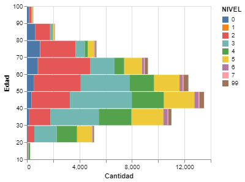
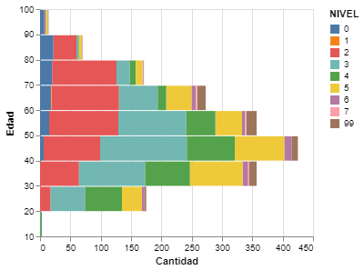
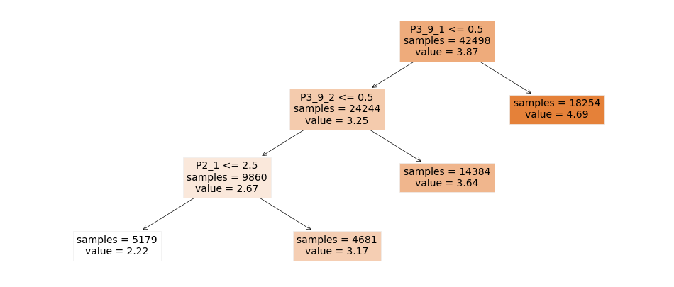

# Resultados

# Los Datos

Los datos de esta encuesta se componen de 3 tablas: vivienda, hogar y residentes. Cada tabla ofrece datos según el tópico que describe, en el caso de la vivienda y el hogar muestra las siguientes variables:

<ol>
    <li>UPM - Unidad primaria de muestreo</li>
    <li>VIV_SEL - Vivienda Seleccionada</li>
    <li>P1_1 - Material piso vivienda - 1 Tierra, 2 Cemento o firme, 3 Madera, mosaico u otro recubrimiento</li>
    <li>P1_2 - Método de surtido de agua - 1 agua entubada dentro de la vivienda?, 2 agua entubada fuera de la vivienda, pero dentro del terreno?, 3 agua entubada de llave pública (o hidrante)?, 4  agua entubada que acarrean de otra vivienda?, 5 agua de pipa?, 6 agua de un pozo, río, arroyo, lago u otro?</li>
    <li>P1_3 - Drenaje - 1 la red pública?, 2 una fosa séptica?, 3 una tubería que va a dar a una barranca o grieta?, 4 una tubería que va a dar a un río, lago o mar?, 5 ¿No tiene drenaje? </li>
    <li>P1_4 - Energía Eléctrica - 1 Sí, 2 No</li>
    <li>P1_5_1 - Disponen de refrigerador - 1 Sí, 2 No</li>
    <li>P1_5_2 - Disponen de lavadora - 1 Sí, 2 No</li>
    <li>P1_5_3 - Disponen de automóvil - 1 Sí, 2 No</li>
    <li>P2_1 - Cuantas personas viven en la casa</li>
    <li>P2_2 - Todas las personas comparten el mismo gasto? - 1 Sí, 2 No</li>
    <li>P2_3 - Cuántos hogares o grupos tienen gasto separado</li>
    <li>P4_1_1 - Disponen de radio - 1 Sí, 2 No</li>
    <li>P4_1_2 - Disponen de Televisor analógico - 1 Sí, 2 No</li>
    <li>P4_1_3 - Disponen de decodificador de TV digital abierta - 1 Sí, 2 No</li>
    <li>P4_1_4 - Disponen de pantalla plana - 1 Sí, 2 No</li>
    <li>P4_1_5 - Disponen de Consola de videojuegos - 1 Sí, 2 No</li>
    <li>P4_1_6 - Disponen de celular - 1 Sí, 2 No</li>
    <li>P4_1_6_1 - Cuantos celulares tienen - 99 No Sabe</li>
    <li>P4_1_6_2 - Cuantos celulares son inteligentes - 99 No sabe</li>
    <li>P4_2_1 - Disponen de computadora de escritorio - 1 Sí, 2 No</li>
    <li>P4_2_2 - Disponen de laptop - 1 Sí, 2 No</li>
    <li>P4_2_3 - Disponen de tablet - 1 Sí, 2 No</li>
    <li>P4_3 - motivo por el que no tienen computadora, laptop o tablet - 1 Falta de recursos económicos, 2 No les interesa o no la necesitan, 3 No saben usarla, 4 Utilizan un celular inteligente (Smartphone) u otro dispositivo para conectarse a Internet, 5 Porqué está descompuesta, 6 Por razones relacionadas con la privacidad o seguridad, 7 Otra razón, 8 No responde</li>
    <li>P4_3A - Otra razón</li>
    <li>P4_4 - Disponen de internet - 1 Sí, 2 No</li>
    <li>P4_8 - Porque no disponen de internet - 1 Falta de recursos económicos (servicio incosteable), 2 No les interesa o no lo necesitan, 3 No sabe usarlo, 4 Desconoce su utilidad, 5 Equipo insuficiente o sin capacidad, 6 No hay proveedor o infraestructura en su localidad, 7 Tienen acceso a Internet en otros lugares, 8 Por razones relacionadas con la privacidad o seguridad, 9 Otra razón, 10 No responde</li>
    <li>P5_8_2 - Monto pagado a servicios digitales - 0 no paga, 9999 No sabe</li>
    <li>P5_11_1 - Esta satisfecho con el servicio de internet - 1 Satisfecho, 2 Insatisfecho, 3 No cuenta con el servicio, 8 No quiso o no supo responder </li>
</ol>

Las variables buscan caracterizar la situación de los residentes con preguntas de servicios básicos, condiciones básicas del hogar y comodidades a su vez, esto interpreta el estrato social al que pertenece.

En la siguiente tabla residentes contienen preguntas del tipo académico, tanto el grado, uso de teléfonos inteligentes, uso de internet, entre otras características que se muestran a continuación:

<ol>
    <li>PAREN - Parentesco con el jefe del hogar - 1 Jefe(a), 2 Esposo(a) o compañero(a), 3 Hijo(a), 4 Nieto(a), 5 Otro parentesco, 6 Sin parentesco</li>
    <li>SEXO - Genero (hombre o mujer)</li>
    <li>EDAD</li>
    <li>P3_7 - Asiste Actualmente a la escuela</li>
    <li>NIVEL - Nivel máximo de estudios - 00 Ninguno, 01 Preescolar o kínder, 02 Primaria, 03 Secundaria, 04 Normal básica, 05 Estudio técnico terminal con secundaria, 06 Preparatoria o bachillerato, 08 Licenciatura o ingeniería, 09 Especialidad,  10 Maestría, 11 Doctorado, 99 No sabe </li>
    <li>GRADO - Año o grado máximo</li>
    <li>P3_9_1 - Uso de computadora  en los últimos 3 meses - 1 Sí, 2 No, 9 No sabe</li>
    <li>P3_9_2 - Uso de internet en los últimos 3 meses - 1 Sí, 2 No, 9 No sabe</li>
    <li>P3_9_3 - Uso de celular en los últimos 3 meses - 1 Sí, 2 No, 9 No sabe</li>
    <li>UPM_DIS - Unidad primaria de muestreo</li>
    <li>EST_DIS - Estrato de diseño muestral</li>
    <li>DOMINIO - Población rural y urbana - U urbana R rural</li>
    <li>TLOC - Tamaño de la localidad - 1 100,000 y más habitantes, 2 15,000 a 99,999 habitantes, 3 2,500 a 14,999 habitantes, 4 menor a 2500 habitantes</li>
    <li>ENT - Entidad - 01 Aguascalientes, 02 Baja California, 03 Baja California Sur, 04 Campeche, 05 Coahuila de Zaragoza, 06 Colima, 07 Chiapas, 08 Chihuahua, 09 Ciudad de México, 10 Durango, 11 Guanajuato, 12 Guerrero, 13 Hidalgo, 14 Jalisco, 15 Estado de México, 16 Michoacán de Ocampo, 17 Morelos, 18 Nayarit, 19 Nuevo León, 20 Oaxaca, 21 Puebla, 22 Querétaro, 23 Quintana Roo, 24 San Luis Potosí, 25 Sinaloa, 26 Sonora, 27 Tabasco, 28 Tamaulipas, 29 Tlaxcala, 30 Veracruz de Ingancio de la Llave, 31 Yucatán, 32 Zacatecas
</li>
</ol>

## Análisis EDA

Se utilizan los siguientes datos que corresponden a los residentes encuestados. Para nuestro estudio unos de los datos más importantes es 'NIVEL' y corresponde al nivel educativo de la persona encuestada.

|    UPM |   VIV_SEL |   HOGAR |   NUM_REN |   PAREN |   SEXO |   EDAD |   DIA |   MES |   P3_7 |   NIVEL |   GRADO |   P3_9_1 |   P3_9_2 |   P3_9_3 |   P3_10 |   P3_11 |   P3_12 |   FAC_HOGAR |   UPM_DIS |   EST_DIS | DOMINIO   |   TLOC |   ESTRATO |   ENT |
|-------:|----------:|--------:|----------:|--------:|-------:|-------:|------:|------:|-------:|--------:|--------:|---------:|---------:|---------:|--------:|--------:|--------:|------------:|----------:|----------:|:----------|-------:|----------:|------:|
| 100023 |         1 |       1 |         1 |       1 |      2 |     41 |    16 |     9 |      2 |      10 |       2 |        1 |        1 |        1 |       1 |     nan |       1 |         174 |         1 |         7 | U         |      1 |         3 |     1 |
| 100023 |         2 |       1 |         1 |       1 |      1 |     46 |     2 |     9 |      2 |       6 |       3 |        2 |        1 |        1 |       7 |     nan |     nan |         174 |         1 |         7 | U         |      1 |         3 |     1 |
| 100023 |         2 |       1 |         2 |       2 |      2 |     47 |     5 |     9 |      2 |       3 |       3 |        2 |        1 |        1 |       6 |       4 |     nan |         174 |         1 |         7 | U         |      1 |         3 |     1 |
| 100023 |         2 |       1 |         3 |       3 |      2 |     23 |    22 |     1 |      2 |       6 |       3 |        1 |        1 |        1 |       1 |     nan |       1 |         174 |         1 |         7 | U         |      1 |         3 |     1 |
| 100023 |         2 |       1 |         5 |       3 |      2 |     17 |    22 |    10 |      1 |       6 |       2 |        1 |        1 |        1 |       5 |       4 |     nan |         174 |         1 |         7 | U         |      1 |         3 |     1 |
| 100023 |         2 |       1 |         6 |       3 |      1 |     13 |    25 |     8 |      1 |       3 |       1 |        1 |        1 |        1 |       5 |       4 |     nan |         174 |         1 |         7 | U         |      1 |         3 |     1 |
| 100023 |         2 |       1 |         4 |       3 |      2 |     21 |    17 |     9 |      2 |       6 |       3 |        1 |        1 |        1 |       6 |       4 |     nan |         174 |         1 |         7 | U         |      1 |         3 |     1 |
| 100023 |         3 |       1 |         1 |       1 |      2 |     50 |     5 |     6 |      2 |       8 |       4 |        1 |        1 |        1 |       1 |     nan |       1 |         174 |         1 |         7 | U         |      1 |         3 |     1 |
| 100023 |         3 |       1 |         2 |       3 |      2 |     19 |     5 |     6 |      1 |       8 |       1 |        1 |        1 |        1 |       1 |     nan |       1 |         174 |         1 |         7 | U         |      1 |         3 |     1 |
| 100023 |         4 |       1 |         1 |       1 |      1 |     56 |    16 |     8 |      2 |       2 |       6 |        2 |        1 |        1 |       1 |     nan |       4 |         174 |         1 |         7 | U         |      1 |         3 |     1 |

A continuación se presentan los datos de la vivienda. Aquí se presentan distintos atributos que nos ayudarán a saber la cantidad de tecnología presente en la vivienda.

|    UPM |   VIV_SEL |   P1_1 |   P1_2 |   P1_3 |   P1_4 |   P1_5_1 |   P1_5_2 |   P1_5_3 |   P2_1 |   P2_2 |   P2_3 |   FAC_VIV |   UPM_DIS |   EST_DIS | DOMINIO   |   TLOC |   ESTRATO |   ENT |
|-------:|----------:|-------:|-------:|-------:|-------:|---------:|---------:|---------:|-------:|-------:|-------:|----------:|----------:|----------:|:----------|-------:|----------:|------:|
| 100023 |         1 |      3 |      1 |      1 |      1 |        1 |        1 |        1 |      1 |      1 |    nan |       174 |         1 |         7 | U         |      1 |         3 |     1 |
| 100023 |         2 |      3 |      1 |      1 |      1 |        1 |        1 |        1 |      6 |      1 |    nan |       174 |         1 |         7 | U         |      1 |         3 |     1 |
| 100023 |         3 |      3 |      1 |      1 |      1 |        1 |        1 |        1 |      2 |      1 |    nan |       174 |         1 |         7 | U         |      1 |         3 |     1 |
| 100023 |         4 |      3 |      1 |      1 |      1 |        1 |        1 |        2 |      9 |      1 |    nan |       174 |         1 |         7 | U         |      1 |         3 |     1 |
| 100023 |         5 |      3 |      1 |      1 |      1 |        1 |        1 |        2 |      3 |      1 |    nan |       174 |         1 |         7 | U         |      1 |         3 |     1 |
| 100029 |         1 |      3 |      1 |      1 |      1 |        1 |        1 |        2 |      5 |      1 |    nan |       222 |         2 |         6 | U         |      1 |         2 |     1 |
| 100029 |         2 |      3 |      1 |      1 |      1 |        1 |        1 |        1 |      3 |      1 |    nan |       222 |         2 |         6 | U         |      1 |         2 |     1 |
| 100029 |         3 |      2 |      1 |      1 |      1 |        2 |        2 |        2 |      5 |      1 |    nan |       222 |         2 |         6 | U         |      1 |         2 |     1 |
| 100029 |         5 |      3 |      1 |      1 |      1 |        1 |        1 |        1 |      3 |      1 |    nan |       222 |         2 |         6 | U         |      1 |         2 |     1 |
| 100037 |         1 |      3 |      1 |      1 |      1 |        1 |        1 |        2 |      6 |      1 |    nan |       169 |         3 |         7 | U         |      1 |         3 |     1 |

La cantidad de registros en estas tablas se encuentra organizada por entidad federativa de la República Mexicana y se puede apreciar en el siguiente mapa.

|  |
|:--:|
| <b>Mapa de cantidad de personas en el registro por entidad federativa</b>|

De igual manera se pueden representar cuales de estos registros son hombres y mujeres en el mapa. Pueden observarse algunas diferencias en los mapas como entre el noroeste y noreste del pais que parecen invertirse. Lo anterior puede representar un posible sesgo en la recolección de los datos.

|  |
|:--:|
| <b>Mapa de cantidad de Mujeres en el registro por entidad federativa</b>|

|  |
|:--:|
| <b>Mapa de cantidad de Hombres en el registro por entidad federativa</b>|

Para nuestro estudio utilizamos el Jefe de cada vivienda para seguir con el análisis. A continuación se diferencia sexo del jefe de la vivienda por nivel académico. Puede observarse claramente como en este caso si existe un dominio del sexo masculino en nivel educativo.

|  |
|:--:|
| <b>Cantidad de registros de cada jefe de vivienda según nivel educativo y sexo</b>|

Ahora comparamos el nivel educativo según la edad de cada registro. En el siguiente gráfico puede observarse como el nivel educativo disminuyendo según subimos en la edad de cada encuestado.

|  |
|:--:|
| <b>Cantidad de registros según edad y nivel educativo de los jefes de vivienda</b>|

### Jalisco

En esta sección se repiten algunos de los análisis, pero nos enfocamos en los registros del estado de Jalisco. Se puede observar como el efecto es ligeramente más pronunciado que en el caso de los datos nacionales, conforme se incrementa el nivel educativo son menos mujeres las que son jefes de vivienda.

|  |
|:--:|
| <b>Número de registros de jefes de vivienda por nivel educativo y sexo en el estado de Jalisco</b>|

En la siguiente parte se revisa nuevamente el nivel educativo por edad. Puede observarse como el patrón nacional se repite, conforme sube la edad, el nivel educativo va disminuyendo.

|  |
|:--:|
| <b>Número de registros de jefes de vivienda por nivel educativo y edad en el estado de Jalisco</b>|

Ahora revisamos el uso de la computadora o pc por edad. Puede observarse como también este valor va disminuyendo con la edad, siendo el máximo entre los 30 y 50 años. Lo anterior tiene sentido ya que se trata en las edades donde existen más trabajadores. Es importante mencionar que el uso de la pc en los últimos 3 meses nunca es dominante en estos niveles de edad graficados.

|  |
|:--:|
| <b>Número de registros de jefes de vivienda por uso de la computadora en los últimos 3 meses y edad en el estado de Jalisco</b>|

Por último se revisa el uso del internet en los últimos 3 meses. Puede observarse como a diferencia del gráfico anterior este si es dominante en la población por edad en general. Nuevamente se observa como disminuye conforme incrementa la edad.

|  |
|:--:|
| <b>Número de registros de jefes de vivienda por uso del internet en los últimos 3 meses y edad en el estado de Jalisco</b>|

## Modelo de clasificación por árboles de decisión

Conociendo la naturaleza de los datos, se decidió preguntarse si es que el nivel educativo puede clasificarse según aspectos de la vivienda (cantidad de tecnología) e indicadores socio-económicos presentados en el dataset. Para esto se pre-procesan los datos.

El nivel de estudios se estandariza de acuerdo las notas del inicio (0: Nada, 1:Kinder, etc). Esto permite una interpretación más clara de la información y que al momento de crear los predictores la secuencia sea lineal ascendente.

La encuesta en la que se basa este dataset tiene la peculiaridad de que utilizan el valor 2 como "no", así que lo cambiamos por 0 para que la interpretación sea mas lógica con 0 = No y 1 = Si.

Posteriormente se divide el estudio en 2 aspectos de interés: el jefe de cada vivienda y el nivel máximo de estudios de alguno de los integrantes de la vivienda. Esto era un aspecto interesante porque se sabe que no necesariamente el jefe de la vivienda será la persona que más haya estudiado.

### Jefe de familia

Antes de entrenar el modelo graficamos el nivel educativo donde podemos ver la distribución de los niveles. La mayor cantidad de personas donde la primaria y secundaria son las que tienen mayor cantidad de registros.

|  |
|:--:|
| <b>Distribución de nivel de registros según el nivel educativo (reestructurado) para el jefe de vivienda en México</b>|

#### Entrenamiento

Con el dataset limpio y organizado podemos hacer el modelo. Dividimos el dataset en sets de entrenamiento y de pruebas, donde el objetivo es el Atributo Nivel.

Se entrena el modelo de manera preliminar se encuentran los siguientes aspectos.
1. El uso de equipo de computo es el primer determinante (nodo).
2. El Grado (educativo) se superpone al de Nivel así que se elimina del modelo.

Posteriormente se eliminan  atributos que no se identifican como determinantes. A continuación se presenta la versión final y recortada del árbol de decisión.

|  |
|:--:|
| <b>Árbol de decisión para clasificar el nivel educativo (reestructurado) para el jefe de vivienda en México</b>|

Después de crear el modelo, obtenemos las siguientes observaciones 
1. El atributo con mayor peso en el nivel de estudios es el Uso de computadora - están muy relacionados.
2. Después el uso de internet.
3. En el siguiente nivel es la edad del jefe de la vivienda.

Con este modelo se consigue un error (rmse) de test es de 1.039. Esto implica que utilizando este árbol podemos estar aproximadamente 1 nivel seguros de nuestra predicción. Si predecimos nivel secundaria, puede que el resultado real esté entre primaria y preparatoria.

### Nivel máximo de estudios

Nuevamente se revisa primeramente la distribución de los registros. Graficamos el nivel educativo donde podemos ver la distribución de los niveles. La mayor cantidad de personas donde la licenciatura es la que tiene mayor cantidad de registros. Esto contrasta con lo visto en la sección anterior, podemos ver como la naturaleza de estos conjuntos es distinta.

|  |
|:--:|
| <b>Distribución de nivel de registros según el nivel educativo (reestructurado) para la persona con mayor nivel educativo en la vivienda</b>|

Se ejecuta un proceso de limpieza similar que en la sección anterior y se encuentran resultados similares pero con una matiz distinta.

|  |
|:--:|
| <b>Arbol de decisión para clasificar el nivel educativo (reestructurado) para la persona con máximo nivel de estudios en la vivienda</b>|

Después de crear el modelo, obtenemos las siguientes observaciones 
1. El atributo con mayor peso en el nivel de estudios sigue siendo el Uso de computadora en los últimos 3 meses.
2. Después ha hecho uso de Internet en los últimos 3 meses.
3. Por último si posee una laptop (computadora personal).

Con este modelo se consigue un error (rmse) de test es de 0.88. Esto implica que utilizando este arbol podemos estar aproximadamente 1 nivel seguros de nuestra predicción. Es importante mencionar que este modelo es ligeramente mejor que el anterior.

## Discusión

Con esta información podemos observar que el uso de tecnologías de información (computadora, internet, celular) esta directamente relacionado con el nivel de estudios. Cuando hacemos una predicción del nivel de estudios, el primer parametro a considerar es si el individuo hace uso de la computadora y sí hace uso de internet.

Es importante resaltar que aunque nuestro objetivo era predecir con base en los datos de la vivienda, estos terminan siendo no tan relevantes para la predicción.

En cuanto a la diferencia entre los conjuntos de datos de Nivel máximo de estudios en la vivienda y Nivel de estudios en el jefe de la vivienda, podemos obtener observaciones interesantes. Si el individuo posee una laptop ayudará a clasificar si el nivel máximo de estudios es primaria o secundaria, sabiendo que no usa internet o computadora recientemente. Un efecto parecido ocurre con la edad del jefe de la vivienda en la primera clasificación, el efecto es claro, no uso de la computadora e internet y una edad avanzada esta relacionado a bajo nivel educativo (primaria).

## Conclusión

La tabla presentada contiene información sumamente importante sobre como se encuentra actualmente el uso de las tecnologías de información en México. Uno de los datos más importantes es el nivel educativo de la persona encuestada, el cual se encuentra representado por la columna "NIVEL" y es el objetivo de este estudio.

Existen datos que pueden ser relevantes para futuros análisis, pero en este estudio se centran principalmente en el nivel educativo de la persona encuestada.

Se podría considerar la inclusión de más detalles sobre la encuesta en sí, como el tamaño de la muestra, la población objetivo, y la metodología utilizada para obtener los datos. Estos detalles podrían proporcionar una mejor comprensión del contexto en el que se realizaron los análisis.

A manera de cierre, el uso de tecnologías de información como la computadora e internet, se encuentra estrechamente relacionado con el nivel de estudios de las personas. Es importante tener en cuenta este factor al hacer predicciones sobre el nivel educativo de un individuo. Por lo tanto, el acceso y la capacitación en el uso de estas herramientas se convierten en aspectos clave para mejorar las oportunidades educativas y laborales de las personas, especialmente en la actualidad donde la tecnología juega un papel fundamental en diversos aspectos de la vida.

