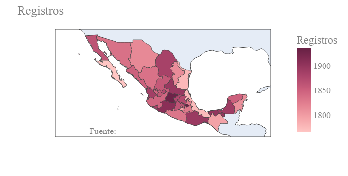

# Resultados

## Análisis EDA

Se utilizan los siguientes datos que corresponden a los residentes encuestados. Para nuestro estudio unos de los datos más importantes es 'NIVEL' y corresponde al nivel educativo de la persona encuestada.

|    UPM |   VIV_SEL |   HOGAR |   NUM_REN |   PAREN |   SEXO |   EDAD |   DIA |   MES |   P3_7 |   NIVEL |   GRADO |   P3_9_1 |   P3_9_2 |   P3_9_3 |   P3_10 |   P3_11 |   P3_12 |   FAC_HOGAR |   UPM_DIS |   EST_DIS | DOMINIO   |   TLOC |   ESTRATO |   ENT |
|-------:|----------:|--------:|----------:|--------:|-------:|-------:|------:|------:|-------:|--------:|--------:|---------:|---------:|---------:|--------:|--------:|--------:|------------:|----------:|----------:|:----------|-------:|----------:|------:|
| 100023 |         1 |       1 |         1 |       1 |      2 |     41 |    16 |     9 |      2 |      10 |       2 |        1 |        1 |        1 |       1 |     nan |       1 |         174 |         1 |         7 | U         |      1 |         3 |     1 |
| 100023 |         2 |       1 |         1 |       1 |      1 |     46 |     2 |     9 |      2 |       6 |       3 |        2 |        1 |        1 |       7 |     nan |     nan |         174 |         1 |         7 | U         |      1 |         3 |     1 |
| 100023 |         2 |       1 |         2 |       2 |      2 |     47 |     5 |     9 |      2 |       3 |       3 |        2 |        1 |        1 |       6 |       4 |     nan |         174 |         1 |         7 | U         |      1 |         3 |     1 |
| 100023 |         2 |       1 |         3 |       3 |      2 |     23 |    22 |     1 |      2 |       6 |       3 |        1 |        1 |        1 |       1 |     nan |       1 |         174 |         1 |         7 | U         |      1 |         3 |     1 |
| 100023 |         2 |       1 |         5 |       3 |      2 |     17 |    22 |    10 |      1 |       6 |       2 |        1 |        1 |        1 |       5 |       4 |     nan |         174 |         1 |         7 | U         |      1 |         3 |     1 |
| 100023 |         2 |       1 |         6 |       3 |      1 |     13 |    25 |     8 |      1 |       3 |       1 |        1 |        1 |        1 |       5 |       4 |     nan |         174 |         1 |         7 | U         |      1 |         3 |     1 |
| 100023 |         2 |       1 |         4 |       3 |      2 |     21 |    17 |     9 |      2 |       6 |       3 |        1 |        1 |        1 |       6 |       4 |     nan |         174 |         1 |         7 | U         |      1 |         3 |     1 |
| 100023 |         3 |       1 |         1 |       1 |      2 |     50 |     5 |     6 |      2 |       8 |       4 |        1 |        1 |        1 |       1 |     nan |       1 |         174 |         1 |         7 | U         |      1 |         3 |     1 |
| 100023 |         3 |       1 |         2 |       3 |      2 |     19 |     5 |     6 |      1 |       8 |       1 |        1 |        1 |        1 |       1 |     nan |       1 |         174 |         1 |         7 | U         |      1 |         3 |     1 |
| 100023 |         4 |       1 |         1 |       1 |      1 |     56 |    16 |     8 |      2 |       2 |       6 |        2 |        1 |        1 |       1 |     nan |       4 |         174 |         1 |         7 | U         |      1 |         3 |     1 |

A continuación se presentan los datos de la vivienda. Aquí se presentan distintos atributos que nos ayudarán a saber la cantidad de tecnología presente en la vivienda.

|    UPM |   VIV_SEL |   P1_1 |   P1_2 |   P1_3 |   P1_4 |   P1_5_1 |   P1_5_2 |   P1_5_3 |   P2_1 |   P2_2 |   P2_3 |   FAC_VIV |   UPM_DIS |   EST_DIS | DOMINIO   |   TLOC |   ESTRATO |   ENT |
|-------:|----------:|-------:|-------:|-------:|-------:|---------:|---------:|---------:|-------:|-------:|-------:|----------:|----------:|----------:|:----------|-------:|----------:|------:|
| 100023 |         1 |      3 |      1 |      1 |      1 |        1 |        1 |        1 |      1 |      1 |    nan |       174 |         1 |         7 | U         |      1 |         3 |     1 |
| 100023 |         2 |      3 |      1 |      1 |      1 |        1 |        1 |        1 |      6 |      1 |    nan |       174 |         1 |         7 | U         |      1 |         3 |     1 |
| 100023 |         3 |      3 |      1 |      1 |      1 |        1 |        1 |        1 |      2 |      1 |    nan |       174 |         1 |         7 | U         |      1 |         3 |     1 |
| 100023 |         4 |      3 |      1 |      1 |      1 |        1 |        1 |        2 |      9 |      1 |    nan |       174 |         1 |         7 | U         |      1 |         3 |     1 |
| 100023 |         5 |      3 |      1 |      1 |      1 |        1 |        1 |        2 |      3 |      1 |    nan |       174 |         1 |         7 | U         |      1 |         3 |     1 |
| 100029 |         1 |      3 |      1 |      1 |      1 |        1 |        1 |        2 |      5 |      1 |    nan |       222 |         2 |         6 | U         |      1 |         2 |     1 |
| 100029 |         2 |      3 |      1 |      1 |      1 |        1 |        1 |        1 |      3 |      1 |    nan |       222 |         2 |         6 | U         |      1 |         2 |     1 |
| 100029 |         3 |      2 |      1 |      1 |      1 |        2 |        2 |        2 |      5 |      1 |    nan |       222 |         2 |         6 | U         |      1 |         2 |     1 |
| 100029 |         5 |      3 |      1 |      1 |      1 |        1 |        1 |        1 |      3 |      1 |    nan |       222 |         2 |         6 | U         |      1 |         2 |     1 |
| 100037 |         1 |      3 |      1 |      1 |      1 |        1 |        1 |        2 |      6 |      1 |    nan |       169 |         3 |         7 | U         |      1 |         3 |     1 |

La cantidad de registros en estas tablas se encuentra organizada por entidad federativa de la República Mexicana y se puede apreciar en el siguiente mapa.

De igual manera se pueden representar cuales de estos registros son hombres y mujeres en el mapa. Pueden observarse algunas diferencias en los mapas como entre el noroeste y noreste del pais que parecen invertirse. Lo anterior puede representar un posible sesgo en la recolección de los datos.

Para nuestro estudio utilizamos el Jefe de cada vivienda para seguir con el análisis. A continuación se diferencia sexo del jefe de la vivienda por nivel académico. Puede observarse claramente como en este caso si existe un dominio del sexo masculino en nivel educativo.

Ahora comparamos el nivel educativo según la edad de cada registro. En el siguiente gráfico puede observarse como el nivel educativova disminuyendo según subimos en la edad de cada encuestado.

### Jalisco

En esta sección se repiten algunos de los análsis, pero nos enfocamos en los registros del estado de Jalisco. Se puede observar como el efecto es ligeramente más pronunciado que en el caso de los datos nacionales, conforme se incrementa el nivel educativo son menos mujeres las que son jefes de vvivienda.

En la siguiente parte se revisa nuevamente el nivel educativo por edad. Puede observarse como

## 